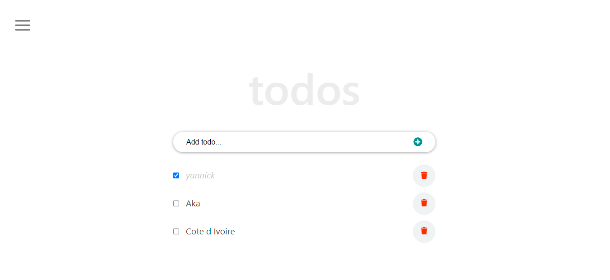

# React to-do App

> This project entails building a user-friendly and responsive to-do app in which a user can add new tasks, check completed tasks, delete tasks, and remove completed tasks. This project saves users task in local Storage so that user can see all his tasks when he leaves the app and comes back. This project was built with React.js.



## Live Demo

[Live Demo Link](https://codecaiine.github.io/react-todo-list-app/)

## Built 
- HTML
- CSS
- Javascript
- React
- Linters (React & Redux)
- Git

## Get Started

Please get your browser update.

. To get a local copy up and running follow these simple steps.
   ```
   git clone <URL> in your terminal
   ```

. Run
   ```
   cd react-todo-list-app
   ```

Install npm
   ```
   npm install
   ```

   ```
   npm run build
   ```

Launch the server
   ```
   run start
   ```

Run the test 
   ```
   npm run test
   ```


## Author

👤 **Yannick-Noel AKA**

- Location: Côte d'Ivoire
- GitHub: [@codecaiine](https://github.com/codecaiine)
- Twitter: [@yannicknaka](https://twitter.com/yannicknaka)
- LinkedIn: [LinkedIn](https://www.linkedin.com/in/yannick-no%C3%ABl-aka/)

## 🤝 Contributing

Contributions, issues, and feature requests are welcome!

Feel free to check the [issues page](https://github.com/codecaiine/react-todo-list-app/issues).

## Show your support

Give a ⭐️ if you like this project!

## Acknowledgments

- Hat tip to [ibaslogic](https://ibaslogic.com/react-tutorial-for-beginners/)
- Inspiration
- etc