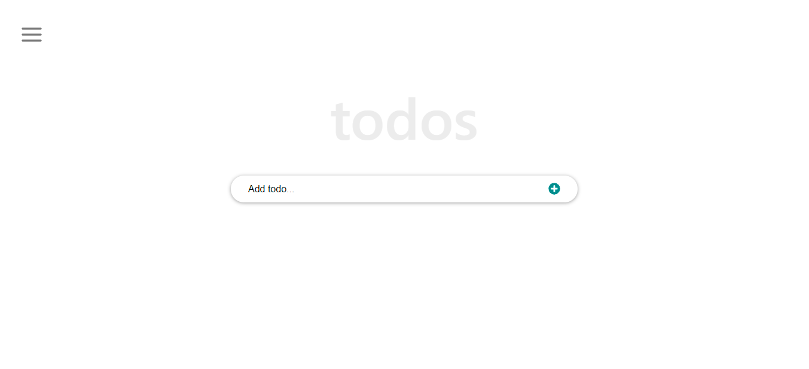

# React ToDo list App

This is a To-Do list app that allows users to add new tasks, mark completed tasks, edit existing tasks and delete tasks.




 

## Live Demo

[Live Demo Link](https://math-magicians-aka.netlify.app/)

## Built 
- HTML
- CSS
- Javascript
- React
- Linters (React & Redux)
- Git

## Get Started

Please get your browser update.

. To get a local copy up and running follow these simple steps.
   ```
   git clone <URL> in your terminal
   ```

. Run
   ```
   cd react-todo-list-app
   ```

Install npm
   ```
   npm install
   ```

   ```
   npm run build
   ```

Launch the server
   ```
   run start
   ```

Run the test 
   ```
   npm run test
   ```


## Author

👤 **Yannick-Noel AKA**

- Location: Côte d'Ivoire
- GitHub: [@codecaiine](https://github.com/codecaiine)
- Twitter: [@yannicknaka](https://twitter.com/yannicknaka)
- LinkedIn: [LinkedIn](https://www.linkedin.com/in/yannick-no%C3%ABl-aka/)

## 🤝 Contributing

Contributions, issues, and feature requests are welcome!

Feel free to check the [issues page](https://github.com/codecaiine/react-todo-list-app/issues).

## Show your support

Give a ⭐️ if you like this project!

## Acknowledgments

- Thanks to Microverse
- Yannick AKA

